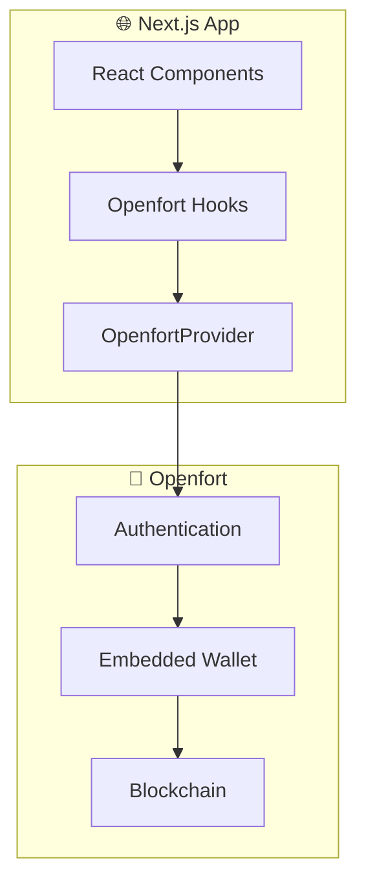
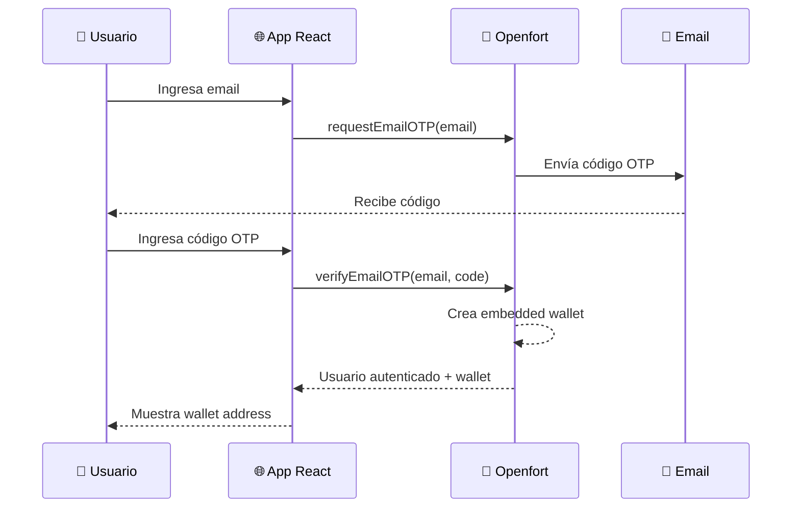
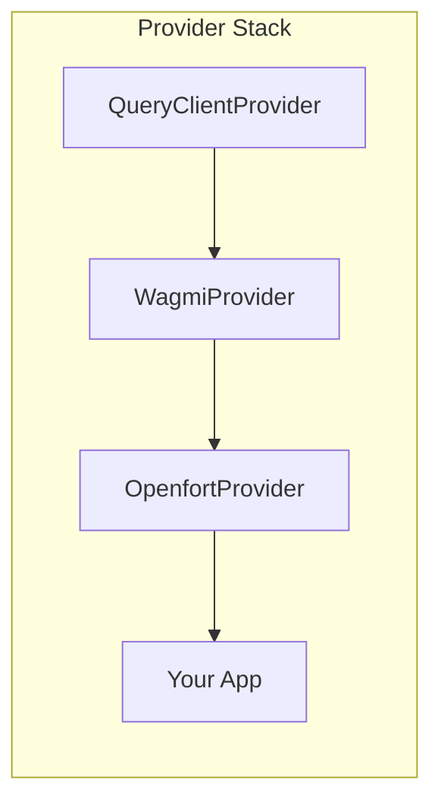
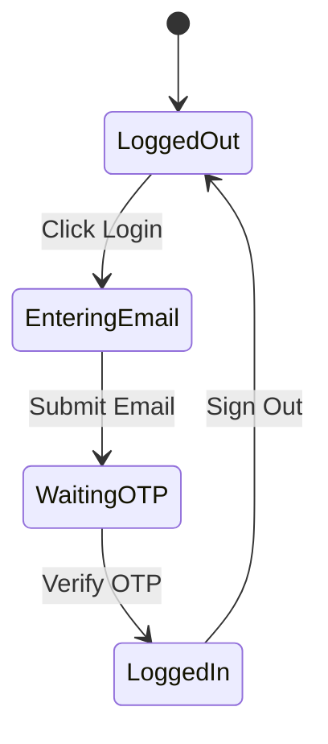

# Openfort React SDK

[](https://opensource.org/licenses/MIT)
[](https://nextjs.org/)
[](https://openfort.xyz)

Wallets embebidas con autenticación por email usando Openfort React SDK. Sin frases semilla, sin extensiones de navegador, sin fricción.

## 🎥 Video Tutorial

Este repositorio acompaña el video tutorial de CodaLabs:
**[Openfort React SDK: Wallets Embebidas en tu App Web](https://youtube.com/@CodaLabs)**

## ✨ Características

- 🔐 **Autenticación por Email** — Login simple sin MetaMask
- 💰 **Wallets Embebidas** — Creación automática de wallet
- ⚡ **Sin Extensiones** — No requiere instalar nada
- 🎨 **UI Moderna** — Tailwind CSS + shadcn/ui
- 🔄 **React Hooks** — API declarativa y fácil de usar

## 🏗️ Arquitectura



## 🔄 Flujo de Autenticación



## 📁 Estructura del Proyecto

```
openfort-react-sdk/
├── app/
│   ├── layout.tsx        # Layout con providers
│   ├── page.tsx          # Página principal
│   └── providers.tsx     # Openfort + Wagmi providers
├── components/
│   ├── auth-button.tsx   # Botón de autenticación
│   ├── wallet-display.tsx # Display de wallet
│   └── ui/               # Componentes shadcn/ui
├── lib/
│   └── utils.ts          # Utilidades
├── .env.example
├── LICENSE
└── README.md
```

## 🚀 Quick Start

### 1. Clonar el Repositorio

```bash
git clone https://github.com/CodaLabs-xyz/openfort-react-sdk.git
cd openfort-react-sdk
```

### 2. Instalar Dependencias

```bash
npm install
```

### 3. Configurar Variables de Entorno

```bash
cp .env.example .env.local
```

Edita `.env.local` con tu clave de Openfort:

```env
NEXT_PUBLIC_OPENFORT_PUBLISHABLE_KEY=pk_your_key_here
```

Obtén tu clave en [Openfort Dashboard](https://dashboard.openfort.xyz)

### 4. Ejecutar

```bash
npm run dev
```

Abre [http://localhost:3000](http://localhost:3000) 🎉

## 🔧 Configuración

### OpenfortProvider



```tsx
// app/providers.tsx
import { OpenfortProvider } from '@openfort/react';

export function Providers({ children }) {
  return (
    <QueryClientProvider client={queryClient}>
      <WagmiProvider config={wagmiConfig}>
        <OpenfortProvider 
          publishableKey={process.env.NEXT_PUBLIC_OPENFORT_PUBLISHABLE_KEY!}
        >
          {children}
        </OpenfortProvider>
      </WagmiProvider>
    </QueryClientProvider>
  );
}
```

## 📚 API Reference

### Hooks Disponibles

| Hook | Descripción |
|------|-------------|
| `useUser()` | Obtiene el usuario autenticado |
| `useWallets()` | Obtiene las wallets del usuario |
| `useEmailAuth()` | Autenticación por email |
| `useSignOut()` | Cerrar sesión |

### useEmailAuth

```tsx
import { useEmailAuth } from '@openfort/react';

function LoginForm() {
  const { 
    requestOTP,      // Solicitar código
    verifyOTP,       // Verificar código
    isLoading,       // Estado de carga
    error            // Error si hay
  } = useEmailAuth();
  
  const handleLogin = async (email: string) => {
    await requestOTP({ email });
    // Usuario recibe código por email...
  };
  
  const handleVerify = async (code: string) => {
    await verifyOTP({ email, code });
    // Usuario autenticado con wallet!
  };
}
```

### useWallets

```tsx
import { useUser, useWallets } from '@openfort/react';

function WalletInfo() {
  const { user } = useUser();
  const { wallets } = useWallets();
  
  const embeddedWallet = wallets?.find(
    w => w.walletClientType === 'openfort'
  );
  
  if (!user) return <p>Please sign in</p>;
  
  return (
    <div>
      <p>Email: {user.email}</p>
      <p>Wallet: {embeddedWallet?.address}</p>
    </div>
  );
}
```

## 🎨 Componentes

### AuthButton



### WalletDisplay

Muestra la información de la wallet con:
- Dirección truncada (0x1234...abcd)
- Botón de copiar
- Balance (opcional)
- Network indicator

## 🛠️ Tech Stack

- [Next.js 14](https://nextjs.org/) — React framework
- [Openfort React SDK](https://www.npmjs.com/package/@openfort/react) — Embedded wallets
- [Wagmi](https://wagmi.sh/) — React hooks for Ethereum
- [TanStack Query](https://tanstack.com/query) — Data fetching
- [Tailwind CSS](https://tailwindcss.com/) — Styling
- [shadcn/ui](https://ui.shadcn.com/) — UI components

## 🐛 Troubleshooting

<details>
<summary><b>Error: "Invalid publishable key"</b></summary>

- Verifica que la clave empiece con `pk_`
- Asegúrate de usar `NEXT_PUBLIC_` prefix
- Revisa que el archivo sea `.env.local`

</details>

<details>
<summary><b>Error: "Email OTP failed"</b></summary>

- Verifica que el email sea válido
- Revisa spam/junk folder
- El código expira en 10 minutos

</details>

<details>
<summary><b>Wallet no aparece después del login</b></summary>

- Espera unos segundos (creación async)
- Revisa la consola para errores
- Verifica conexión a internet

</details>

## 🔗 Recursos

- [Documentación Openfort](https://openfort.io/docs)
- [Openfort React SDK](https://openfort.io/docs/libraries/react)
- [Openfort Dashboard](https://dashboard.openfort.xyz)
- [Serie de Videos CodaLabs](https://youtube.com/@CodaLabs)

## 📄 Licencia

Este proyecto está bajo la licencia MIT. Ver [LICENSE](LICENSE) para más detalles.

---

<p align="center">
  Made with ❤️ by <a href="https://github.com/CodaLabs-xyz">CodaLabs</a>
</p>
